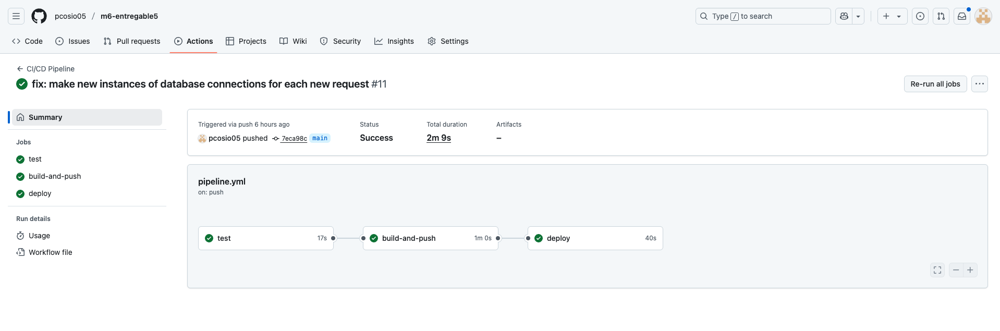
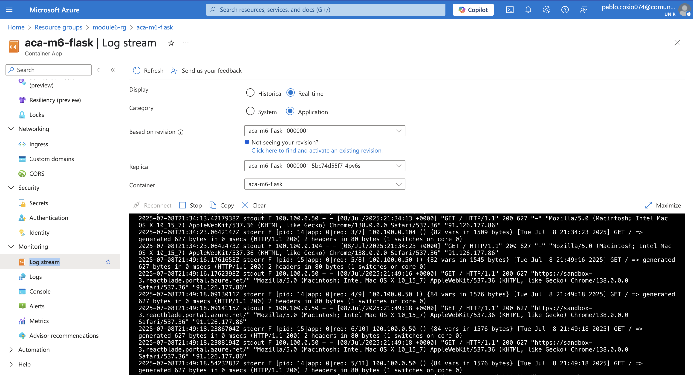

# Module 6 - Entregable 5
### Task Management System (Python Flask)

## Table of Contents

1. [Environment Set-up](#1-environment-set-up)
2. [Containerization of the Application](#2-containerization-of-the-application)
3. [Storage of Container Images in Azure Container Registry](#3-storage-of-container-images-in-azure-container-registry)
4. [App Deployment (Azure Container Apps)](#4-app-deployment-azure-container-apps)
5. [CI/CD Automation](#5-cicd-automation)
6. [Application Observability](#6-application-observability)

---

## 1. Environment Set-up

This project is designed to run in Azure using a variety of managed services. The following Azure resources are required and were created as part of the environment:

- **Resource Group**: Logical container for all resources.
- **Azure Container Registry (ACR)**: Stores container images.
- **Log Analytics Workspace**: For collecting and analyzing logs.
- **Azure Container Apps Environment**: Hosts the application containers.
- **User Assigned Managed Identities (UAMI)**: For secure access to ACR and ACA.
- **Azure Container App (ACA)**: Runs the Flask application.
- **Azure MySQL Database**: Persistent database for the app.

Go [here](./docs/azure-resources-creation.md) for checking all the steps (with commands) that have been followed. 

---

## 2. Containerization of the Application

The application is fully containerized:
- **Dockerfile**: Defines the build for the Flask app using Gunicorn for production.
- **docker-compose.yml**: Orchestrates the Flask app and a MySQL database for local development/testing.

### Local Bootstrap & Testing
1. Ensure you have a `.env` file in the project root with the required variables (see example in previous README).
2. Build and start the services:
    ```sh
    docker-compose up --build -d
    ```
3. The app will be available at [http://localhost:5000/user-stories](http://localhost:5000/user-stories)
4. To stop and remove containers:
    ```sh
    docker-compose down -v
    ```

---

## 3. Storage of Container Images in Azure Container Registry

An Azure Container Registry (ACR) instance was created in the environment set-up (acrmodule6). This is used to store and distribute container images for deployment.

### Example: Pushing and Pulling Images

Login to ACR:
```sh
az acr login --name acrmodule6
```

Build and tag your image:
```sh
docker build -t acrmodule6.azurecr.io/m6-entregable5:test .
```

Push the image to ACR:
```sh
docker push acrmodule6.azurecr.io/m6-entregable5:test
```

Pull the image from ACR:
```sh
docker pull acrmodule6.azurecr.io/m6-entregable5:test
```

---

## 4. App Deployment (Azure Container Apps)

The application is deployed to Azure Container Apps (ACA):
- The ACA instance is created and configured to pull images from ACR using a user-assigned managed identity.
- The deployment is performed using the Azure CLI, referencing the image in ACR.
- Secrets (such as environment variables and database credentials) are managed using ACA secrets, which can be set via the Azure CLI or scripts.


---

## 5. CI/CD Automation

A GitHub Actions workflow is provided in `.github/workflows/`:
- On every push or pull request to `main`, tests are run using pytest.
- If tests pass, a Docker image is built and pushed to ACR. The name and tag of the container are taken from this [file](pyproject.toml).
- The last step consist on updating the image of the Azure Container App instance with the previous built image

The workflow uses GitHub secrets and variables for authentication and secure access to Azure resources.
  - secrets
  
  - variables
  

You can view one execution of the pipeline and check the three commented steps that are performed within the pipeline:


---

## 6. Application Observability

### Viewing Logs
- The application running in ACA sends logs to the configured Log Analytics workspace.
- You can view logs in different ways:
  - stream logs directly using az cli: 
        
        az containerapp logs show --name aca-module6-flask --resource-group module6-rg --follow  
  - From Azure Portal, using Log Analytics:
  
  - From Azure Portal, using Log Streams:
  


### Testing and Observing Requests
- Make a request to your deployed app (e.g., using curl or your browser):
    ```sh
    curl https://aca-module6-flask.nicesea-c3f325e6.spaincentral.azurecontainerapps.io//user-stories
    ```
- Then, check the logs as above to see the request and application output.

---

For more details on endpoints and features, see the source code and comments in the `app/` directory. 