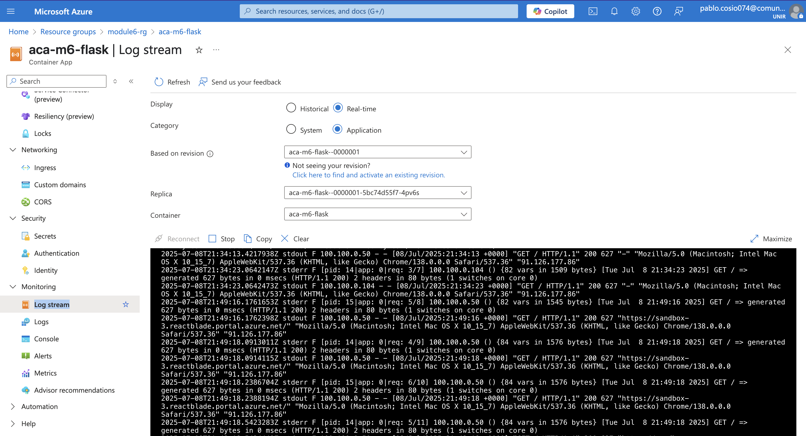
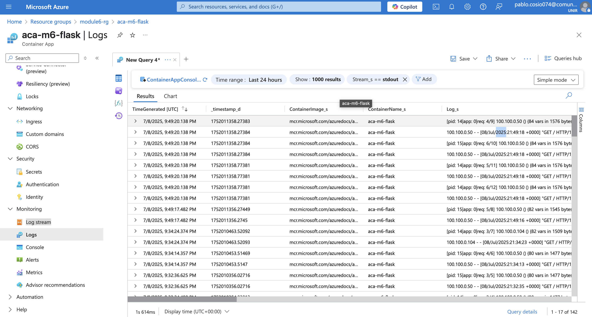

# Create resources on Azure 

Index of steps that I have followed to prepare the Azure environment for allowing git action to build and deploy the app to Azure.

1. [Create Azure resource group](#azure-resource-group)
2. [Create Azure Container Registry](#azure-container-registry)
3. [Create Azure Container App environment](#azure-container-app-environment)
4. [Create Azure Container App](#azure-container-app)
5. [Create Azure Container App secrets and map to environment variables within the container](#azure-container-app-secrets)
6. [Create Azure MySQL Database](#create-azure-mysql-database)
7. [UAMI Container APP access to ACR](#assign-role-acrpull-to-the-uami-used-by-the-container-app)
8. [Create UAMI (User Access Managed Identity) for Github connection](#uami)
9. [Allow Github UAMI to get MS Entra access token authentication.](#allow-github-to-get-ms-entra-access-token-authentication)
10. [Assign roles to Github UAMI for accesing to ACR and ACA.](#assign-roles-for-the-uami-acrpush-and-container-apps-contributor)
11. [Attach log workspace to ACA](#logs)


## Azure Resource Group

```sh
LOCATION=spaincentral
RESOURCE_GROUP=module6-rg
SUBSCRIPTION_ID=edabee57-517e-4fe7-a351-21d1cf8dbf36

az group create \
  --name $RESOURCE_GROUP \
  --location $LOCATION
```
## Azure Container Registry
```sh
az provider register --namespace Microsoft.ContainerRegistry

ACR_NAME=acrmodule6
SKU=Basic

az acr create \
  --name $ACR_NAME \
  --resource-group $RESOURCE_GROUP \
  --sku $SKU \
  --location $LOCATION \
  --admin-enabled false
```
## Azure Container App environment
```
CONTAINERAPPS_ENV=aca-m6-env

az provider register -n Microsoft.OperationalInsights --wait

az containerapp env create \
  --name $CONTAINERAPPS_ENV \
  --resource-group $RESOURCE_GROUP \
  --location $LOCATION
```

## Azure Container App
```
CONTAINERAPP_NAME=aca-m6-flask
DOCKER_IMAGE=mcr.microsoft.com/azuredocs/aks-helloworld:v1

az containerapp create \
  --name $CONTAINERAPP_NAME \
  --resource-group $RESOURCE_GROUP \
  --environment $CONTAINERAPPS_ENV \
  --image $DOCKER_IMAGE \
  --ingress external \
  --target-port 80 \
  --cpu 0.5 \
  --memory 1.0Gi \
  --min-replicas 1 \
  --max-replicas 1 \
  --system-assigned
```

## Azure Container App secrets
```
chmod 744 ./scripts/create-secrets.sh 

./scripts/create-secrets.sh ".env" $CONTAINERAPP_NAME $RESOURCE_GROUP
```

## Create Azure Mysql database
```sh
az mysql flexible-server create \
  --name mysql-db-module6 \
  --resource-group $RESOURCE_GROUP \
  --location $LOCATION \
  --admin-user mysqladmin \
  --admin-password MySecureP@ssw0rd \
  --sku-name Standard_B1ms \
  --version 8.0.21 \
  --storage-size 20 \
  --public-access 0.0.0.0
```

## assign role AcrPull to the UAMI used by the Container App

```sh
UAMI_ACA_PRINCIPAL_ID=$(az containerapp show \
  --name $CONTAINERAPP_NAME \
  --resource-group $RESOURCE_GROUP \
  --query "identity.principalId" \
  --output tsv)

ACR_RESOURCE_ID=$(az acr show --name $ACR_NAME --resource-group $RESOURCE_GROUP --query id --output tsv)


az role assignment create \
  --assignee $UAMI_ACA_PRINCIPAL_ID \
  --role AcrPull \
  --scope $ACR_RESOURCE_ID

```
### UAMI

```sh
UAMI_NAME=module6-github-action-mi

az identity create --name $UAMI_NAME --resource-group $RESOURCE_GROUP
```
## Allow Github to get MS Entra access token authentication
```sh
az identity federated-credential create \
  --name github-cred \
  --identity-name $UAMI_NAME \
  --resource-group $RESOURCE_GROUP \
  --issuer "https://token.actions.githubusercontent.com" \
  --subject "repo:pcosio05/m6-entregable5:ref:refs/heads/main" \
  --audience "api://AzureADTokenExchange"
```
## assign roles for the UAMI: acrPush and "Container Apps Contributor"
```sh
UAMI_PRINCIPAL_ID=$(az identity show \
  --name $UAMI_NAME \
  --resource-group $RESOURCE_GROUP \
  --query principalId \
  --output tsv)
RESOURCE_GROUP_ID="/subscriptions/$SUBSCRIPTION/resourceGroups/$RESOURCE_GROUP"


az role assignment create \
  --assignee $UAMI_PRINCIPAL_ID \
  --role "AcrPush" \
  --scope $ACR_RESOURCE_ID

CONTAINERAPP_SCOPE_URI=$(az containerapp show \
  --name $CONTAINERAPP_NAME \
  --resource-group $RESOURCE_GROUP \
  --query id \
  --output tsv)

az role assignment create \
  --assignee $UAMI_PRINCIPAL_ID \
  --role "Container Apps Contributor" \
  --scope $CONTAINERAPP_SCOPE_URI
```

## LOGS
```sh
WORKSPACE_ID=f4bf8af2-3cd4-4ccf-ab9d-947adda659a1
WORKSPACE_NAME=workspace-module6rgjlBN

WORKSPACE_KEY=$(az monitor log-analytics workspace get-shared-keys \
  --resource-group $RESOURCE_GROUP \
  --workspace-name $WORKSPACE_NAME \
  --query primarySharedKey \
  --output tsv)

# Update the Container App environment to use this workspace
az containerapp env update \
  --name $CONTAINERAPPS_ENV \
  --resource-group $RESOURCE_GROUP \
  --logs-workspace-id $WORKSPACE_ID \
  --logs-workspace-key $WORKSPACE_KEY \
  --logs-destination log-analytics
```


